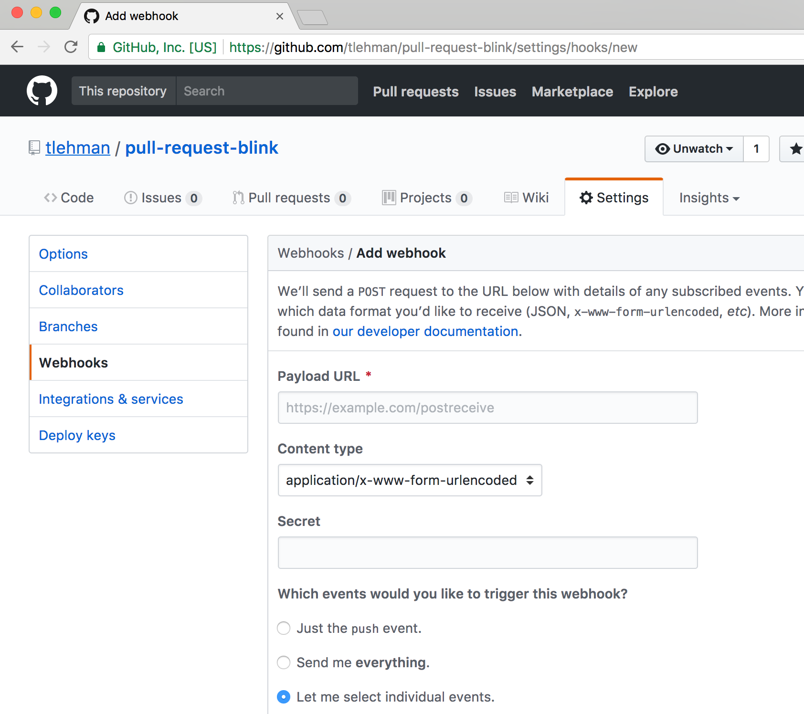
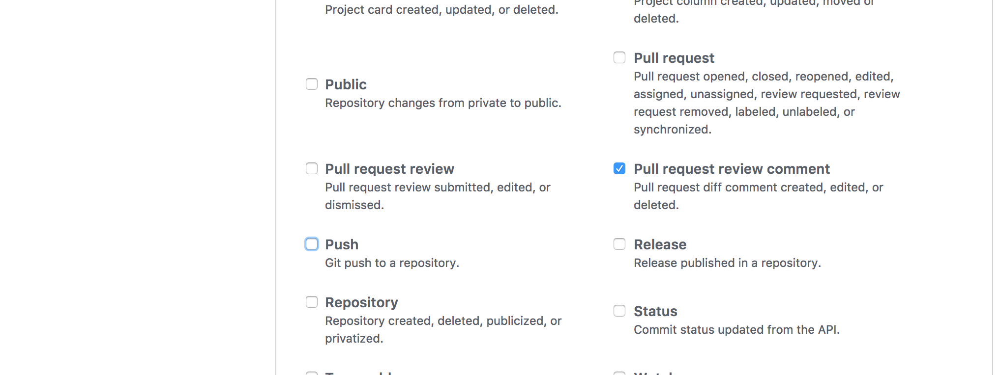

# pull-request-blink

To blink a [Particle Photon light](https://github.com/alexwitherspoon/da-sphere) when 
a Github Pull Request is created, follow these instructions:

1. Clone & deploy this to some public URL (e.g. https://pull-request-blink.awesome)
1. Go to a [github repository](https://github.com/tlehman/pull-request-blink) you would like to get notified about 
1. Create a webhook that will hit https://pull-request-blink.awesome on Pull Request events, and enter a secret (a password):

And that's it!
